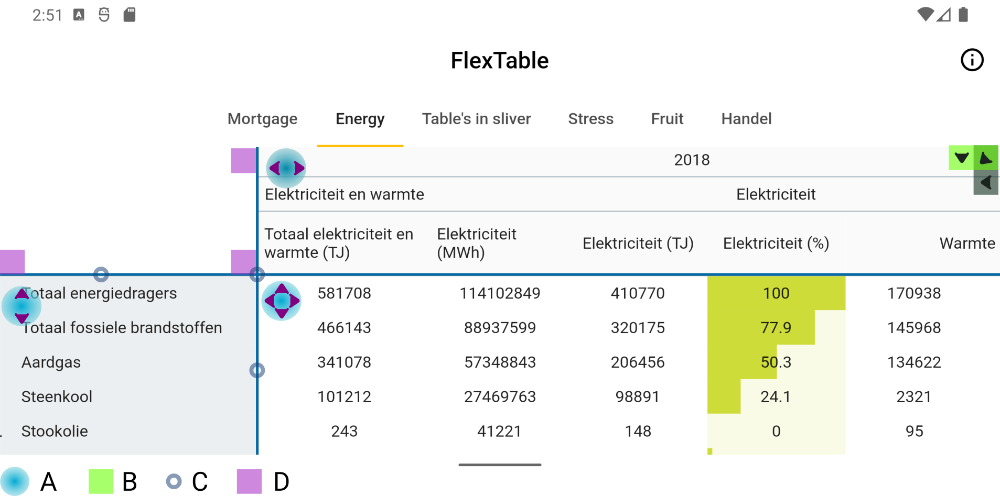

<!--
This README describes the package. If you publish this package to pub.dev,
this README's contents appear on the landing page for your package.

For information about how to write a good package README, see the guide for
[writing package pages](https://dart.dev/guides/libraries/writing-package-pages).

For general information about developing packages, see the Dart guide for
[creating packages](https://dart.dev/guides/libraries/create-library-packages)
and the Flutter guide for
[developing packages and plugins](https://flutter.dev/developing-packages).
-->

# FlexTable

FlexTable is a customizable table with headers, splitView, freezeView, autoFreeze, zoom and scrollbars. The table consist of a model, a viewmodel and builders. Fig. 1 shows some options. The table can scrolls in two directions at the same time. If the first scroll is however horizontal or vertical, the cross direction is locked until the ballistic scroll ends  to prevent a unwanted drift if the user scrolls enthousiatic for serveral pages.

It is also possible to place the FlexTable in a customScrollView by wrapping the FlexTable in a adaptive sliver, wrapped in a sliver the table can only scroll in one direction at the same time.

[Web App Example](http://js-lab.nl/flextable)



Fig. 1: Option: **A.** scroll direction, **B.** Drag to initiate splitView, **C.** Freeze/unfreeze, **D.** Change freeze position


## Getting started

TODO: List prerequisites and provide or point to information on how to
start using the package.

## Usage

```dart
import 'package:flextable/flextable.dart';
import 'package:flutter/material.dart';

void main() {
  runApp(
    MaterialApp(
      theme: ThemeData(
          useMaterial3: true,
          colorScheme: ColorScheme.fromSeed(
              seedColor: const Color.fromARGB(255, 229, 235, 206))),
      home: const ShortExample(),
    ),
  );
}


class ShortExample extends StatefulWidget {
  const ShortExample({super.key});

  @override
  State<ShortExample> createState() => _ShortExampleState();
}

class _ShortExampleState extends State<ShortExample> {
  late FlexTableDataModel dataTable;
  FlexTableController flexTableController = FlexTableController();

  @override
  void initState() {
    super.initState();
  }

  @override
  Widget build(BuildContext context) {
    const columns = 50;
    const rows = 5000;
    dataTable = FlexTableDataModel();
    const lineColor = Color.fromARGB(255, 70, 78, 38);

    for (int r = 0; r < rows; r++) {
      for (int c = 0; c < columns; c++) {
        int rows = 1;
        if ((c + 1) % 2 == 0) {
          if (r % 3 == 0) {
            rows = 3;
          } else {
            continue;
          }
        }
        Map attr = {
          CellAttr.background: (r % 99 < 1
              ? const Color.fromARGB(255, 249, 250, 245)
              : ((r % 2) % 2 == 0
                  ? Colors.white10
                  : const Color.fromARGB(255, 229, 235, 206))),
          CellAttr.textStyle: const TextStyle(
              fontSize: 20, color: Color.fromARGB(255, 70, 78, 38)),
        };

        dataTable.addCell(
            row: r,
            column: c,
            cell: Cell(value: '${numberToCharacter(c)}$r', attr: attr),
            rows: rows);
      }
    }

    dataTable.horizontalLineList.createLineRanges(
        (requestLineRangeModelIndex, requestModelIndex, create) {
      for (int r = 0; r < rows; r += 3) {
        /// Horizontal lines
        ///
        ///
        create(LineRange(
            startIndex: requestLineRangeModelIndex(r),
            lineNodeRange:
                LineNodeRange(requestNewIndex: requestModelIndex, lineNodes: [
              LineNode(
                startIndex: requestModelIndex(0),
                after: const Line(color: lineColor),
              ),
              LineNode(
                startIndex: requestModelIndex(0),
                before: const Line(color: lineColor),
              )
            ])));

        /// Horizontal lines for merged columns
        ///
        ///
        create(LineRange(
            startIndex: requestLineRangeModelIndex(r + 1),
            endIndex: requestLineRangeModelIndex(r + 2),
            lineNodeRange: LineNodeRange(
              requestNewIndex: requestModelIndex,
            )..createLineNodes((requestModelIndex, create) {
                for (int c = 0; c < columns; c += 2) {
                  create(LineNode(
                    startIndex: requestModelIndex(c),
                    after: const Line(color: lineColor),
                  ));
                  create(LineNode(
                    startIndex: requestModelIndex(c + 1),
                    before: const Line(color: lineColor),
                  ));
                }
              })));
      }
    });

    dataTable.verticalLineList.createLineRange(
        (requestLineRangeModelIndex, requestModelIndex) => LineRange(
            startIndex: requestLineRangeModelIndex(0),
            endIndex: requestLineRangeModelIndex(columns),
            lineNodeRange:
                LineNodeRange(requestNewIndex: requestModelIndex, lineNodes: [
              LineNode(
                startIndex: requestModelIndex(0),
                after: const Line(color: lineColor),
              ),
              LineNode(
                startIndex: requestModelIndex(rows),
                before: const Line(color: lineColor),
              ),
            ])));

    final flexTableModel = FlexTableModel(
        columnHeader: true,
        rowHeader: true,
        dataTable: dataTable,
        defaultWidthCell: 120.0,
        defaultHeightCell: 50.0,
        autoFreezeAreasY: [
          for (int r = 0; r < rows - 100; r += 99)
            AutoFreezeArea(startIndex: r, freezeIndex: r + 3, endIndex: r + 90)
        ],
        maximumColumns: columns,
        maximumRows: rows);

    FlexTable flexTable = FlexTable(
        backgroundColor: Colors.white,
        flexTableController: flexTableController,
        flexTableModel: flexTableModel);

    return Scaffold(
        appBar: AppBar(
          centerTitle: true,
          title: const Text('Short FlexTable example'),
        ),
        body: flexTable);
  }
}

```

## Additional information

TODO: Tell users more about the package: where to find more information, how to
contribute to the package, how to file issues, what response they can expect
from the package authors, and more.
